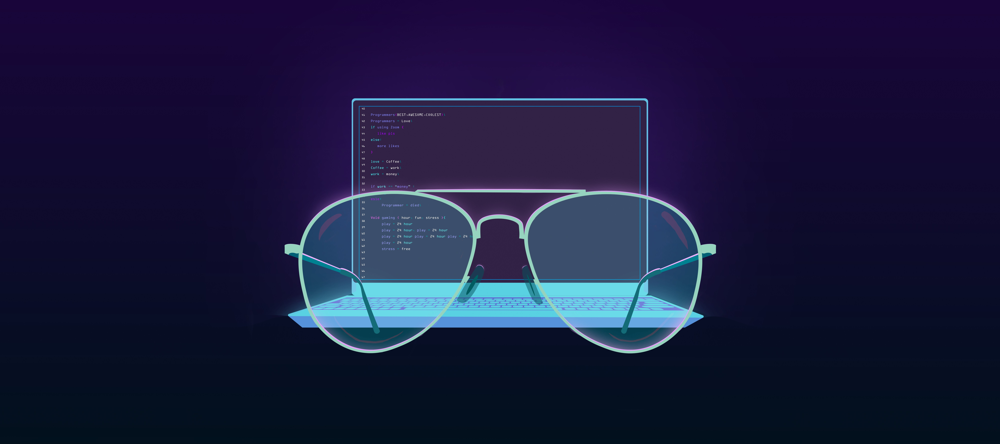

# Hey There 🐝

## Full Stack Developer | DevOps Enthusiast | Educator | PhD in Management
A bit about me:

- 🔥 Developer with over 8 years of experience
- 🌱 Currently learning Advanced DevOps practices 💀
- 🤝 Looking to collaborate on PHP or JS projects
- 🥅 2025 Goals: Contribute more to Open Source projects
- ⚡ Fun fact: I may be short, but my code stands tall!

## 📫 Contact Me:
- Email: a2haritiana@gmail.com
- LinkedIn: [Haritiana Andrianarizaka](https://linkedin.com/in/a2haritiana)

## 🛠️ Skills

